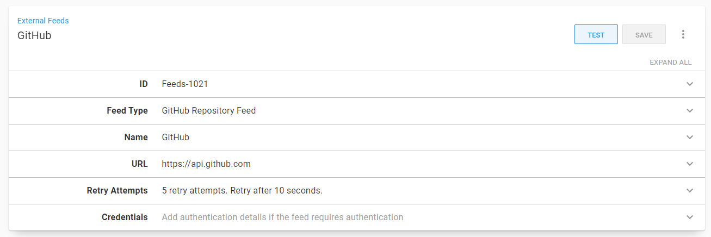

# octopus.local
Configure a local instance of Octopus Deploy using Docker Compose, systemd, and Nginx.

## Instructions

### Requirements

This configuration is intended to run on a Linux server with [docker-compose](https://docs.docker.com/compose/), [nginx](https://www.nginx.com/), and [systemd](https://systemd.io/) installed.

It is developed and tested against Ubuntu 20.04.

### Certificates

Todo

### Octopus Instance

Yep, this configuration is meant to be deployed by Octopus. [Octopus Server and Octopus Cloud](https://octopus.com/pricing/overview) are free to use for up to ten targets. The deployment process depends on the YAML substitution feature so you will need Octopus 2020.4.0 or newer.

The Linux server will need a [Tentacle](https://octopus.com/docs/infrastructure/deployment-targets/linux/tentacle) installed and registed to your instance.

This is a very roundabout way of creating a local Octopus instance since it involves using an existing Octopus instance to deploy it. The main use for this project is to easily create and update development or test lab instances of Octopus.

If you don't have an existing Octopus instance, this [blog post](https://octopus.com/blog/introducing-linux-docker-image) is a good starting point for creating an Octopus instance with docker-compose. The other files in this project can be a reference for setting up systemd and Nginx.

### GitHub External Feed

In your Octopus instance, navigate to **Library > External Feeds**.

Add a new feed. Choose **GitHub Repository Feed**.

The default settings will work. No credentials are required.



Test the feed by searching for **OctopusDeployLabs/octopus.local**.

### Project Variables

Create a new project and navigate to **Variables > Project**. Configure the following variables.

| Variable Name                                                     | Type      |  Suggested Value                 | Notes                                                                             |
|-------------------------------------------------------------------|-----------|----------------------------------|-----------------------------------------------------------------------------------|
| Project.Database.Name                                             | Text      | OctopusDeploy-local              |                                                                                   |
| Project.Database.Password                                         | Sensitive | A strong password.               |                                                                                   |
| Project.Nginx.CertificateKeyLocation                              | Text      | The path to your certificate key |                                                                                   |
| Project.Nginx.CertificateLocation                                 | Text      | The path to your certificate     |                                                                                   |
| Project.Octopus.InstallLocation                                   | Text      | /srv/octopus.local               |                                                                                   |
| Project.Octopus.Port                                              | Text      | 8080                             | Any unused port should work.                                                      |
| Project.Octopus.ServerTag                                         | Text      | latest                           | You can make this a prompted variable if you want to override tag at deploy time. |
| Project.Octopus.ServiceDescription                                | Text      | Octopus Server - Local           |                                                                                   |
| services:db:environment:ACCEPT_EULA                               | Text      | Y                                |                                                                                   |
| services:db:environment:SA_PASSWORD                               | Text      | #{Project.Database.Password}     |                                                                                   |
| services:db:healthcheck:test:5                                    | Text      | #{Project.Database.Password}     |                                                                                   |
| services:db:ports:0                                               | Text      | 1401:1433                        |                                                                                   |
| services:octopus-server:environment:ACCEPT_EULA                   | Text      | Y                                |                                                                                   |
| services:octopus-server:environment:ADMIN_EMAIL                   | Text      | Your email address               |                                                                                   |
| services:octopus-server:environment:ADMIN_PASSWORD                | Sensitive | A strong password                | This is the password you will log on with.                                        |
| services:octopus-server:environment:ADMIN_USERNAME                | Text      | Your preferred username          | This is the username you will log on with.                                        |
| services:octopus-server:environment:DB_CONNECTION_STRING          | Text      | Server=db,1433;Database=#{Project.Database.Name};User=sa;Password=#{Project.Database.Password} |                     |
| services:octopus-server:environment:MASTER_KEY                    | Sensitive | A valid master key value         | See [these instructions](https://octopus.com/docs/installation/octopus-in-container/octopus-server-container-linux#master-key) for creating a master key |
| services:octopus-server:environment:OCTOPUS_SERVER_BASE64_LICENSE | Sensitive | A base 64 license key            | Not required. You can add a license through the UI after.                         |
| services:octopus-server:environment:OCTOPUS_SERVER_NODE_NAME      | Text      | octopus-local-1                  |                                                                                   |
| services:octopus-server:image                                     | Text      | octopusdeploy/octopusdeploy:#{Project.Octopus.ServerTag} |                                                           |
| services:octopus-server:ports:0                                   | Text      | #{Project.Octopus.Port}:8080     |                                                                                   |

### Project Deployment Process

## Files

### docker-compose.yml

This file comes directly from [the Octopus Deploy blog](https://octopus.com/blog/introducing-linux-docker-image). Volumes have been added to support persisting data during upgrades.

### octopus-local.service

This file configures a systemd service to control the Octopus instance and also ensures that it starts when the server boots.

You can stop your instance with:

```
sudo systemctl stop octopus-local
```

And start it with :

```
sudo systemctl start octopus-local
```

### octopus.local site configuration

This is the Nginx site configuration. SSL is enabled, and you need to provide the certificate and key location as variables in the deployment process.

The configuration uses `octopus.local` as the host name. You will need to configure your local DNS server or hosts files to route `octopus.local` to the server hosting this service.

### predeploy.sh

This script creates a user `mssql` with id 10001 to match the user used by the SQL Server container. The local volumes are owned by this user so that the SQL Server container can access them.

### deploy.sh

This script creates or updates the Docker containers, systemd service, and Nginx site.

## Disclaimer

No warranty expressed or implied. Code is provided as is.
